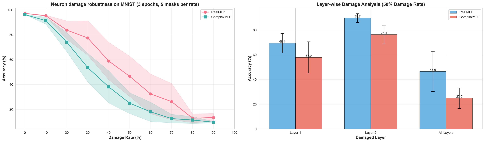
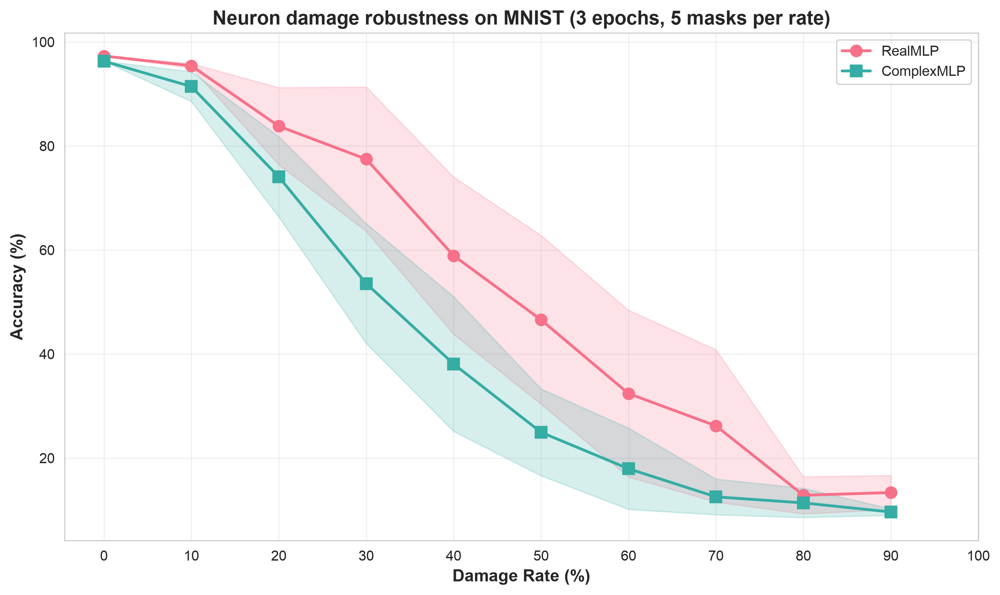
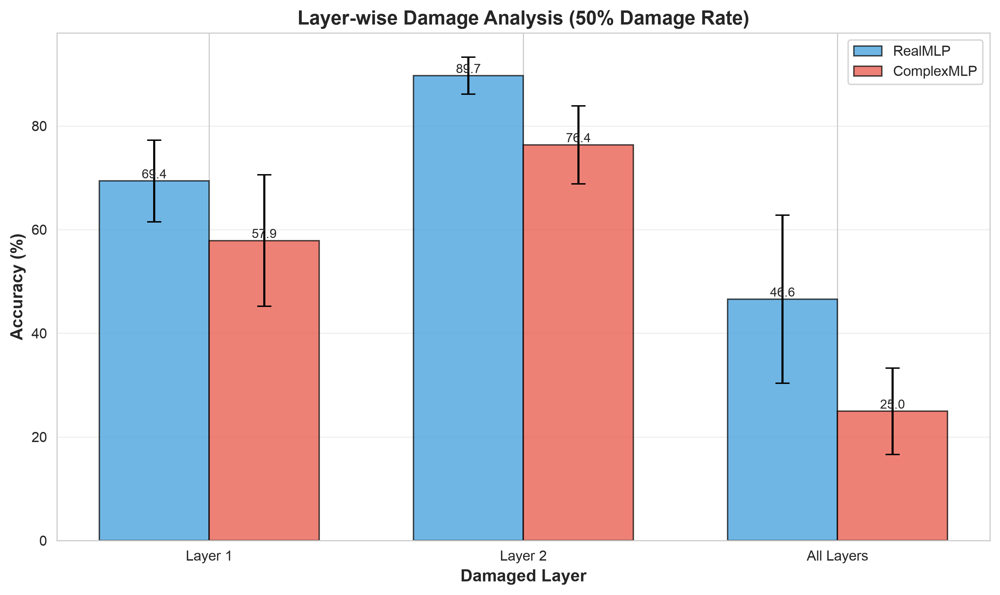
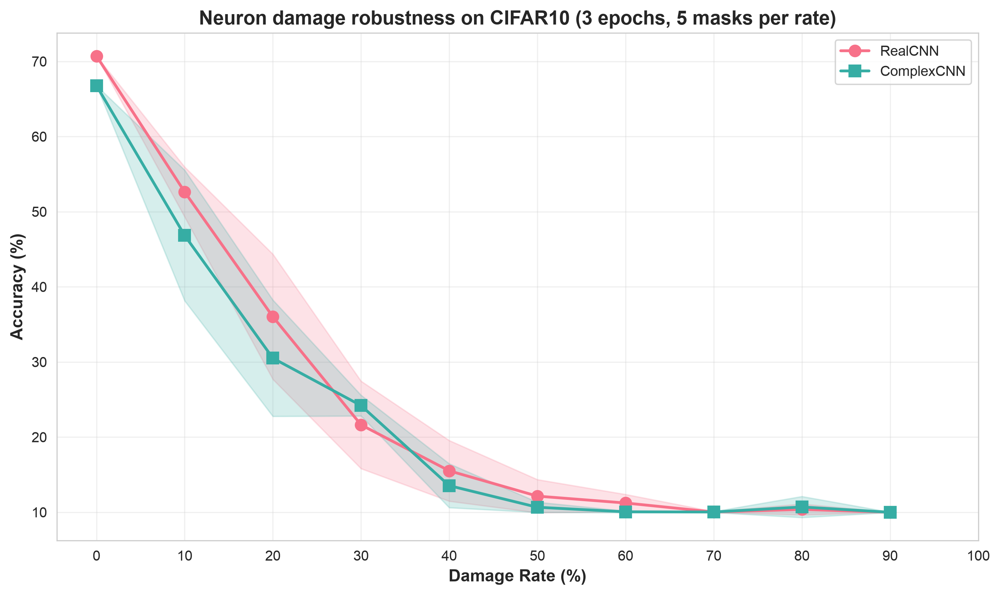
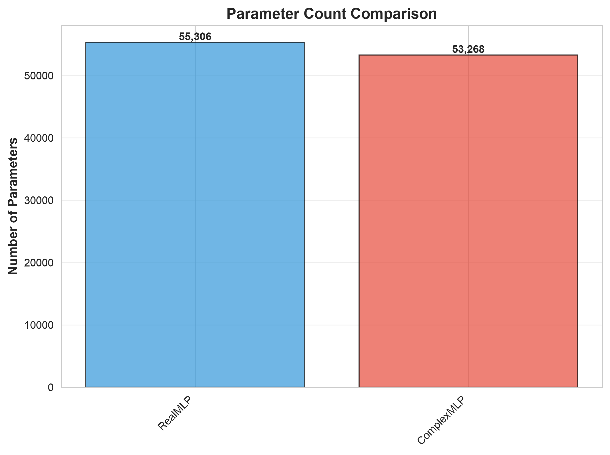

<h1 align="center">Complex-Valued Network Robustness</h1>

<p align="center">
  
  
  
  
</p>

<p align="center">
  <strong>Are complex-valued neural networks more robust to neuron damage than real-valued ones?</strong><br/>
  A small PyTorch research framework that pairs complex and real MLPs / CNNs at (roughly) equal parameter counts,<br/>
  masks neurons at inference time, and measures how accuracy degrades. The models and utilities are implemented,<br/>
  a reduced-protocol demo runs on CPU in about two minutes, and the pre-registered full experiments are still to be run.
</p>

<h3 align="center"><a href="#getting-started"><ins>Getting started</ins></a> · <a href="PROJECT_STATUS.md">Project status document</a></h3>

<p align="center">
  
</p>
<p align="center">
  <sub>MNIST, 3 training epochs per model, 5 random masks per damage rate, seed 42, CPU. Produced by
  <code>experiments/quick_demo.py</code> with the repository's own <code>utils/visualization.py</code> plotting functions.
  This is a smoke run of the pipeline, not the 50-epoch, 5-trial, 10-mask protocol in <code>config.py</code>; do not read it as a result.
  In this run the complex MLP is the <em>less</em> robust of the pair.</sub>
</p>

> The repository name is historical. This project has nothing to do with [yc9954/Vanelia](https://github.com/yc9954/Vanelia),
> the video object-insertion pipeline; the two share no code.

## Features

<table>
<tr>
<td width="50%" valign="middle">

### Damage as a forward hook

`apply_neuron_damage()` builds a random mask for a given damage rate, `DamageHook` multiplies a layer's output by it during inference (both real and imaginary parts for complex layers), and `evaluate_with_damage()` repeats the evaluation over several masks and reports mean ± std.

The curve on the right is Experiment 2 as planned: every hidden layer masked at 0 to 90 %, averaged over independent masks, with the ± 1 std band drawn by `plot_robustness_curves`. Both models start within a point of each other at 0 % (97.3 % vs 96.3 %).

</td>
<td width="50%">
  
</td>
</tr>
<tr>
<td width="50%" valign="middle">

### Layer-wise sensitivity

Experiment 3 as planned: 50 % of the neurons of layer 1 only, layer 2 only, or both hidden layers, five masks each. In both models the first hidden layer is the more sensitive one, and damaging both is much worse than either alone.

`plot_layer_analysis` draws it. The library's own `layer_idx` selector could not be used for this (see [Project status](#project-status)); the demo selects layers by module name.

</td>
<td width="50%">
  
</td>
</tr>
<tr>
<td width="50%" valign="middle">

### The CNN pair on CIFAR-10

`quick_demo.py --cifar` runs the same three experiments on `RealCNN` vs `ComplexCNN` (3 epochs, 70.7 % vs 66.8 % clean test accuracy, about 35 s per epoch on CPU). Both collapse to chance by 50 % damage and their bands overlap almost everywhere, with the complex CNN slightly ahead when only `conv1` or only `conv2` is damaged (35.9 / 38.3 % vs 29.5 / 33.5 %, `docs/layerwise_cnn.png`).

Read with the caveat below: this pair is not parameter-matched, so it is not the comparison the study intends.

</td>
<td width="50%">
  
</td>
</tr>
<tr>
<td width="50%" valign="middle">

### Matched model pairs, checked

`RealMLP` 784 → 64 → 64 → 10 vs `ComplexMLP` 784 → 32c → 32c → 10 for MNIST. `count_parameters` counts each complex parameter twice; the pair comes out at 55,306 vs 53,268 effective real parameters (3.7 % apart, inside `verify_parameters.py`'s 5 % tolerance).

The CNN pair is **not** matched: `RealCNN` 3 → 32 → 64 → FC128 → 10 has 545,546 parameters and `ComplexCNN` 3 → 16c → 32c → FC64c → 10 has 274,196, because halving both the input and output width of a layer quarters its weight count and the ×2 for real/imaginary only gets half of that back. `verify_parameters.py` reports this pair as FAIL.

</td>
<td width="50%">
  
</td>
</tr>
</table>

**Also included**

- **Complex layers from scratch.** `ComplexLinear` implements `(W_r + i·W_i)(x_r + i·x_i)` with two real `nn.Linear` sub-layers (`fc_r`, `fc_i`) and a complex bias, plus `ComplexConv2d`, `ComplexBatchNorm1d/2d`, `ComplexMaxPool2d`, `complex_relu` (ReLU on real and imaginary parts separately), `complex_modulus` (the logits are `|z|`), and complex Glorot initialisation following Trabelsi et al.
- **Data and plots ready.** MNIST and CIFAR-10 loaders with a 90/10 train/validation split and CIFAR augmentation; plotting helpers for robustness curves with error bars, parameter comparison, layer-wise analysis, training curves, and markdown / CSV result tables.
- **Pre-registered protocol.** `config.py` fixes seed 42, 5 trials per experiment, 50 epochs with Adam (lr 1e-3, weight decay 1e-4, early stopping), damage rates 0 % to 90 % in 10 % steps with 10 masks per rate, a 50 % rate for the layer-wise study, and p < 0.05 for significance.
- **A reduced demo.** `experiments/quick_demo.py` trains a pair for a few epochs, runs Experiments 1 to 3 at reduced settings, writes the figures above and a `results_*.json`. With `--cifar` it also does the CNN pair; the whole thing takes about 6 minutes on an Apple M5 CPU.

**Literature foundation** (preserved from the original write-up)

1. Trabelsi et al. (ICLR 2018), *Deep Complex Networks*: the layer implementation.
2. Guberman (2016): complex CNNs show "significantly less vulnerability to overfitting".
3. Arjovsky et al. (2016): unitary matrices preserve gradients.
4. Nguyen et al. (2015): the neural-network robustness problem definition.
5. Gal & Ghahramani (2016): dropout and uncertainty, the link between masking and damage simulation.

The identified gap: no prior systematic study of *structural* (neuron-removal) damage in complex-valued networks; existing work covers overfitting, adversarial robustness and gradient stability.

---

## How it works

```text
config.py (seeds, hyperparameters, damage rates)
     │
     ▼
utils/data.py ──► MNIST / CIFAR-10 loaders (train 90 / val 10 / test)
     │
     ▼
models/  RealMLP ◄─ matched params ─► ComplexMLP        (MNIST)
         RealCNN ◄─ NOT matched ────► ComplexCNN        (CIFAR-10, see above)
     │
     ▼
utils/metrics.py  train_one_epoch → evaluate_model
                  apply_neuron_damage(rate, layer) → DamageHook → evaluate_with_damage (n trials)
     │
     ▼
utils/visualization.py  robustness curves · parameter bars · layer analysis · tables
```

1. **Match.** Complex models are sized so that their effective real parameter count is close to the real model's (`count_parameters` counts complex weights twice). This holds for the MLP pair only.
2. **Train.** Both models of a pair are trained with the same optimiser, schedule and seed, repeated across trials.
3. **Damage.** At inference, a random subset of neurons (output units of a `Linear`, output channels of a `Conv2d`) in one or all hidden layers is masked to zero; each damage rate is evaluated over several independent masks.
4. **Compare.** Accuracy-vs-damage curves with error bars, per-layer sensitivity, and t-tests between complex and real models at each rate.

The three planned experiments: **Exp 1** baseline performance and parameter parity; **Exp 2** damage robustness across 0–90 %; **Exp 3** layer-wise damage (layer 1 only, layer 2 only, all layers at 50 %).

<details>
<summary><strong>Numbers from the demo run (MNIST, 3 epochs, 5 masks)</strong></summary>

| Damage | RealMLP | ComplexMLP |
| --- | --- | --- |
| 0 % | 97.3 | 96.3 |
| 10 % | 95.4 ± 0.4 | 91.4 ± 2.9 |
| 20 % | 83.8 ± 7.4 | 74.1 ± 7.7 |
| 30 % | 77.5 ± 13.9 | 53.6 ± 11.5 |
| 40 % | 58.9 ± 15.1 | 38.1 ± 13.0 |
| 50 % | 46.6 ± 16.2 | 25.0 ± 8.3 |
| 60 % | 32.4 ± 16.0 | 18.0 ± 7.8 |
| 70 % | 26.2 ± 14.6 | 12.5 ± 3.4 |
| 80 % | 12.9 ± 3.6 | 11.4 ± 2.8 |
| 90 % | 13.4 ± 3.3 | 9.6 ± 0.6 |

Layer-wise at 50 %: RealMLP 69.4 / 89.7 / 46.6 and ComplexMLP 57.9 / 76.4 / 25.0 for layer 1 / layer 2 / both.
Training curves for the two models are in `docs/training_realmlp.png` and `docs/training_complexmlp.png` (validation 96.9 % and 96.3 % after epoch 3).

CIFAR-10, same settings (`--cifar`), hidden layers `conv1`, `conv2`, `fc1`:

| Damage | RealCNN | ComplexCNN |
| --- | --- | --- |
| 0 % | 70.7 | 66.8 |
| 10 % | 52.6 ± 3.3 | 46.8 ± 8.7 |
| 20 % | 36.0 ± 8.3 | 30.5 ± 7.7 |
| 30 % | 21.6 ± 5.8 | 24.2 ± 1.4 |
| 40 % | 15.5 ± 4.0 | 13.5 ± 2.9 |
| 50 % | 12.1 ± 2.2 | 10.7 ± 0.7 |
| 60–90 % | 10–11 | 10 |

Layer-wise at 50 %: RealCNN 29.5 / 33.5 / 12.1 and ComplexCNN 35.9 / 38.3 / 10.7 for `conv1` / `conv2` / all three.
Five masks and one training seed is far too few to call any of this a finding; the standard deviations say as much.

</details>

---

## Tech stack

<p>
  <kbd>Python</kbd> &nbsp; <kbd>PyTorch&nbsp;2.0+</kbd> &nbsp; <kbd>torchvision&nbsp;0.15+</kbd> &nbsp; <kbd>NumPy</kbd> &nbsp; <kbd>SciPy</kbd> &nbsp; <kbd>scikit-learn</kbd> &nbsp; <kbd>pandas</kbd> &nbsp; <kbd>matplotlib</kbd> &nbsp; <kbd>seaborn</kbd> &nbsp; <kbd>tqdm</kbd> &nbsp; <kbd>TensorBoard</kbd>
</p>

---

## Getting started

**Prerequisites**

- Python 3 with pip. A GPU is used automatically when CUDA is available (`config.DEVICE`); CPU works and is what the figures were made on (Apple M5, about 2 s per MNIST epoch).
- MNIST and CIFAR-10 download to `./data` on first use through torchvision (10 MB and 170 MB).

```bash
git clone https://github.com/yc9954/Vanelia-PPU-project.git
cd Vanelia-PPU-project
pip install -r requirements.txt

python test_installation.py     # imports, model construction, forward passes on both datasets
python verify_parameters.py     # MLP pair passes (3.7 % apart); CNN pair reports FAIL (49.7 % apart)

python experiments/quick_demo.py                    # MNIST pair, 3 epochs, 5 masks -> results/quick_demo/*.png + results_mlp.json
python experiments/quick_demo.py --cifar            # also the CIFAR-10 CNN pair (unmatched sizes)
python experiments/quick_demo.py --epochs 50 --masks 10 --out results/full   # one trial at the config.py settings (no early stopping)
```

The commands `python experiments/exp1_baseline.py`, `exp2_damage.py` and `exp3_layer_analysis.py` from the original README still do not exist; `quick_demo.py` is a single-trial stand-in for all three and does not run the t-tests. The building blocks are in `utils/metrics.py` (`train_one_epoch`, `evaluate_model`, `evaluate_with_damage`) and `utils/visualization.py`.

---

## Repository structure

| Path | What lives there |
| --- | --- |
| `config.py` | Seeds, datasets, training hyperparameters, MLP / CNN configs, damage rates, device, output dirs, statistics settings. |
| `models/complex_layers.py` | `ComplexLinear`, `ComplexConv2d`, `ComplexBatchNorm1d/2d`, `ComplexMaxPool2d`, `complex_relu`, `complex_modulus`, `complex_flatten`. |
| `models/real_models.py`, `models/complex_models.py` | `RealMLP`, `RealCNN`, `ComplexMLP`, `ComplexCNN`, each with `get_layer_activations`; parameter counters. |
| `utils/data.py` | MNIST and CIFAR-10 dataloaders and dataset info. |
| `utils/metrics.py` | Parameter counting, evaluation, neuron-damage masks and hook, multi-trial damaged evaluation, one training epoch. |
| `utils/visualization.py` | Robustness curves, parameter comparison, layer analysis, training curves, results tables. |
| `experiments/quick_demo.py` | The reduced-protocol demo that made `docs/`. |
| `docs/` | The figures in this README. |
| `test_installation.py`, `verify_parameters.py` | Smoke test and parameter-parity check. |
| `PROJECT_STATUS.md` | The original task checklist and expected result formats (dated 2025-12-26). |

---

## Project status

An unfinished research scaffold, generated in one session on 2025-12-26 (branch `claude/complex-neural-networks-robustness-6X7ac`, merged in PR #1), plus the demo run above. Stated plainly:

**Working today.** The complex layers, the four models, the data loaders, the damage-evaluation utilities and the plotting helpers, the two verification scripts, and `quick_demo.py` end to end on CPU.

**Not done.** The full protocol (50 epochs, 5 trials, 10 masks per rate, significance tests) has not been run; there are no trained checkpoints and no statistics in the repository. The accuracy numbers in `PROJECT_STATUS.md` are placeholders for the expected table format, not measurements. The `results/` directory is git-ignored; the demo's outputs go there.

**Things the code does that the write-up did not say.**
- The CNN pair is not parameter-matched (545,546 vs 274,196); `verify_parameters.py` fails on it. Matching it means widening `ComplexCNN` (for example 23c → 45c channels, FC 91c) or narrowing `RealCNN`.
- `apply_neuron_damage(layer_idx=...)` finds the target layer by parsing a digit out of the module name (`fc1` → 0), but the models name their layers `network.0`, `network.3`, `hidden_layers.0`, ... so the layer-wise selector never matches the MLPs, and for the CNNs `conv1` and `fc1` both map to index 0. `quick_demo.py` selects layers by name instead.
- With `layer_idx=None`, `apply_neuron_damage` masks every `nn.Linear` and `nn.Conv2d` it finds, which includes the `fc_r` / `fc_i` / `conv_r` / `conv_i` sub-layers inside each complex layer *and* the complex layer itself, and also the output layer of both models. A complex model therefore receives roughly three independent masks per layer through `evaluate_with_damage`, which biases the comparison against it (at 50 % it gives 30.7 % for RealMLP vs 11.0 % for ComplexMLP on the demo's models, against 46.6 % vs 25.0 % when hidden layers are masked once). Fix this before running the real experiments.
- `utils/visualization.py` calls `plt.show()` after saving, so it warns under a non-interactive backend; harmless.

**Scope, as the original write-up put it.** No claims about quantum mechanics, AGI or brain-like computation; one focused, testable hypothesis, with results to be reported as-is whether or not they support it. The demo run is reported in that spirit: at these settings the complex MLP degrades faster.

---

## License

The original README stated "MIT License", but no LICENSE file is committed yet, so default copyright applies: all rights reserved.
