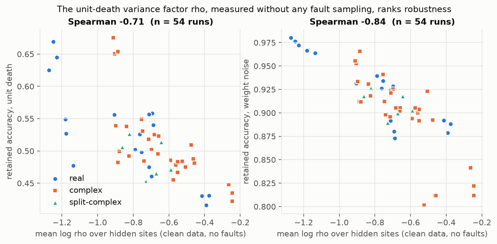
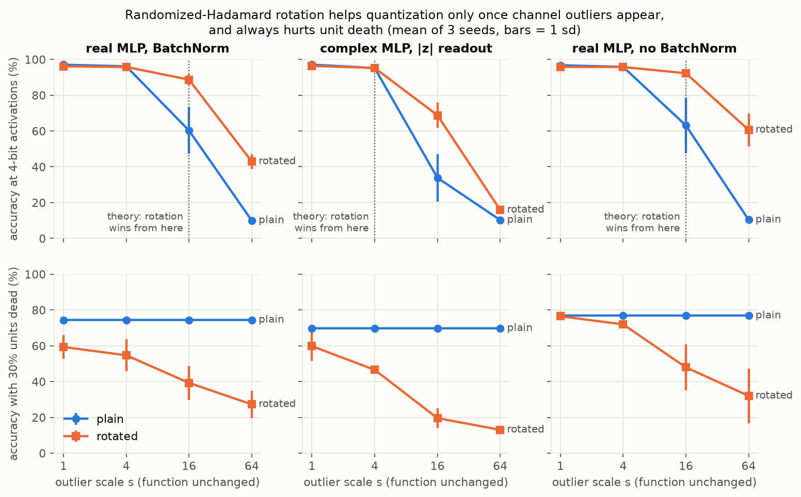
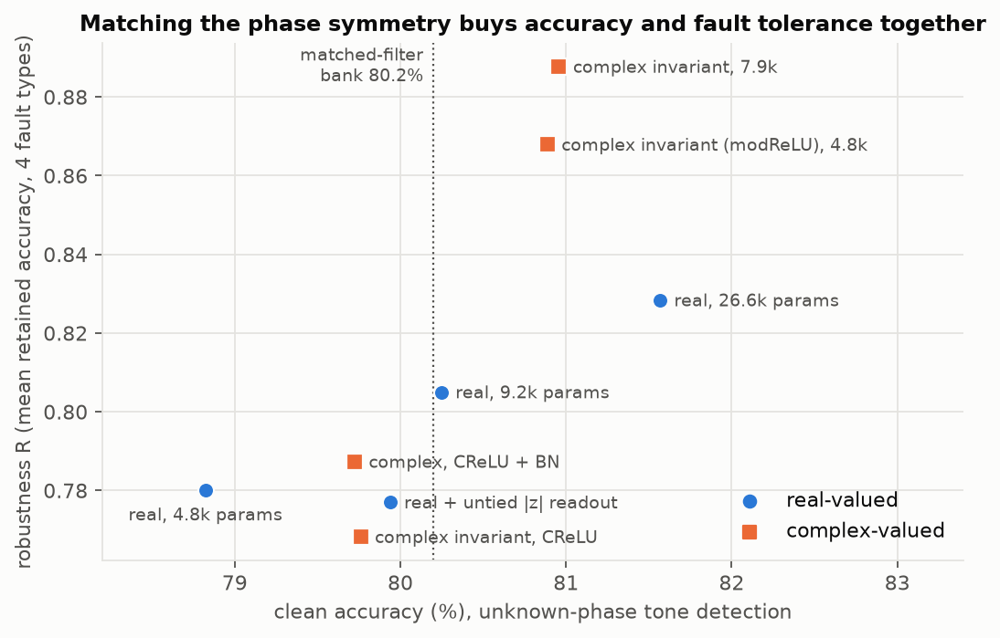
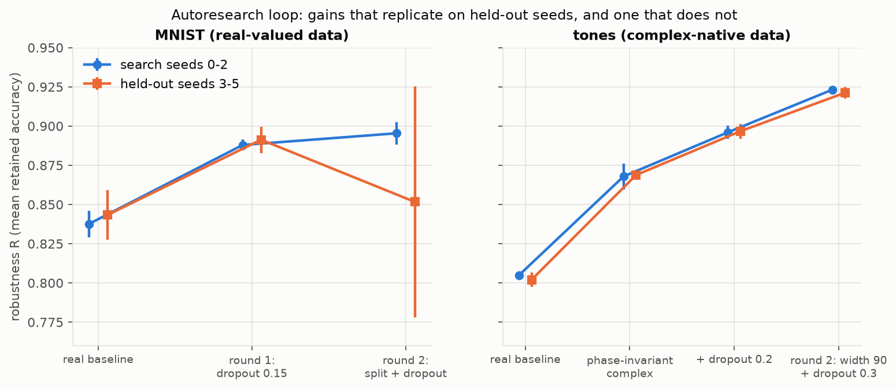

# Where Faults Land: A First-Order Theory of Fault Tolerance, and When Complex-Valued Networks and Rotations Help

*Working draft, generated by an autonomous research loop (see `README.md`, `LOG.md`). Every number
below comes from `runs/runs.jsonl` or `runs/e2.jsonl` and can be regenerated with the commands in
the last section. Status: search and confirmation runs complete (369 logged runs plus the
outlier and pilot experiments); ready for scaling up (Section 6).*

## Abstract

Neural networks increasingly run on substrates that fail in structured ways: units die, analog
weights drift, and every number is quantized. Photonic chips add a twist: they compute with complex
amplitudes. We ask what decides how gracefully a network degrades, and whether complex-valued
networks degrade more gracefully than real ones. A first-order analysis gives a single answer for
every fault type: the error injected into the next layer is the inner product between the fault's
covariance and the downstream gain `G = M^T M`. For unit death it reduces to an exact identity,
`E||delta||^2 / ||Mu||^2 = p^2 + p(1-p) rho`, where `rho` factorises into a *concentration* term
(how unevenly the work is spread over units) and a *cancellation* term (how much the signal relies
on large contributions that interfere destructively). Three consequences are tested in about 400
trained real, complex and split-complex MLPs, with held-out seeds and a held-out dataset. (1) `rho`,
measured on clean data without sampling a single fault, ranks robustness to unit death and weight
noise across architectures (Spearman -0.71 and -0.84, n = 54) and transfers to a different task
(-0.84 and -0.90, n = 66). (2) Random rotations, the incoherence processing behind QuIP,
QuaRot and TurboQuant, only change the alignment between fault and gain. In function-preserving
experiments that inject channel outliers, the theory predicts where rotation flips from hurting to
helping activation quantization, and that rotation always hurts erasure-type faults; in BatchNorm
networks, never-firing units that keep large BatchNorm gain make rotated faults catastrophic.
(3) The statistic is gameable as a training objective (Goodhart), and each fault family has its
own concentration factor, so lowering one can inflate another; dropout is the one intervention that
improves all of them. On the original question, an apparent fragility of complex networks on MNIST
turns out to be an initialisation artifact. On complex-native data, unknown-phase tone detection,
a network that matches the task's phase symmetry (complex multiplication, a phase-preserving
activation and an intensity readout) is 2.1 points more accurate than a real network with the same
parameter count and much more fault tolerant (R 0.868 vs 0.780); removing any one of the three
pieces removes the advantage. Complex-valued networks are more robust when, and only when, their
structure matches the physics of the task.

## 1. Introduction

Fault tolerance used to be a property of hardware; it is becoming a property of models. Aggressive
quantization, analog in-memory computing and photonic accelerators all expose a network's numbers
to errors that the network itself must absorb. Two literatures touch this question from opposite
ends. Dropout theory analyses random unit removal as a training regulariser (Wager et al., 2013);
quantization work has found that rotating weights and activations before rounding, *incoherence
processing*, makes low-bit inference work (QuIP, QuaRot, TurboQuant). Separately, complex-valued
networks (Trabelsi et al., 2018) are the natural model class for coherent optical hardware, which
computes by interference (Shen et al., 2017; Zhang et al., 2021), and it is often suggested that
they are more robust.

This project began with that suggestion as a hypothesis and a small framework to test it. A reduced
demo seemed to show the opposite. Tracing the discrepancy led to a more general question, *where
does a fault land relative to the directions the network amplifies?*, and to the contributions
below.

1. **A first-order theory of fault sensitivity** that is exact for the next layer's pre-activation,
   covers unit death, activation quantization, rotation coding and weight noise in one expression,
   and factorises into concentration and cancellation terms (Section 2).
2. **A clean-data diagnostic.** `rho` needs one forward pass and no fault sampling, and ranks
   unit-death and weight-noise robustness across 54 networks of three algebras (Section 4.2).
3. **When rotations help.** A controlled, function-preserving outlier experiment confirms the
   predicted crossover for TurboQuant-style rotation, and identifies a failure mode, dead units
   behind BatchNorm, that makes rotated faults catastrophic (Section 4.4).
4. **A Goodhart result and a trade-off.** Penalising the diagnostic collapses robustness, and
   centred penalties trade activation-quantization robustness for unit-death robustness; dropout
   does not (Section 4.5).
5. **When complex-valued networks help.** On MNIST they are neither more nor less robust once
   initialisation is matched; on unknown-phase tone detection the phase-symmetric design wins on
   accuracy per parameter and on every fault type, with a causal decomposition of why (Section 4.6).
6. **An autoresearch loop** (in the style of Karpathy's *autoresearch*) that searches designs under
   a fixed budget with a pre-declared keep/discard rule and held-out confirmation (Section 4.7).

## 2. Theory

**Setup.** Take a hidden *site*: the post-activation outputs `u` (n units) of one layer for an
input `x`. Up to the next nonlinearity the eval-mode network is affine, `s = M u + c` (BatchNorm
after the site folds into the next linear layer: `M = W' diag(gamma / sigma)`). A site fault
replaces `u` by `u + e`. The induced error in `s` is `delta = M e`, exactly, with

    E ||delta||^2 = < G, Sigma_e >,   G = M^T M,  Sigma_e = E[e e^T].

Robustness is therefore a question of *alignment*: faults whose covariance avoids the high-gain
directions of `G` are cheap; faults that excite them are expensive.

**Unit death.** With each unit dead independently with probability p, `e = -(1 - m) * u` and
`Sigma_e = p^2 u u^T + p(1-p) diag(u^2)`. Averaging numerator and denominator over inputs,

    E ||delta||^2 / E ||Mu||^2 = p^2 + p(1 - p) rho,   rho = E sum_j G_jj u_j^2 / E ||Mu||^2.

(For exactly k of N units dead: `q2 + (q1 - q2) rho` with `q1 = k/N`, `q2 = k(k-1)/(N(N-1))`.) The
first term is the unavoidable loss of a fraction of the signal; the second is where architectures
differ. `rho` factorises exactly as

    rho = kappa_conc * kappa_cancel,
    kappa_cancel = (tr(G) ||u||^2 / n) / ||Mu||^2,
    kappa_conc   = n sum_j G_jj u_j^2 / (tr(G) ||u||^2).

`kappa_cancel` compares the actual signal with what a randomly oriented input of the same norm
would produce: 1 when contributions add like random vectors, below 1 for constructive interference,
above 1 when the output is built from large contributions that cancel, or when some directions
carry gain the signal never uses. `kappa_conc` is 1 when work is spread evenly over units.

**Rotation coding and incoherence processing.** Storing `v = R u` for an orthogonal `R` and
decoding `R^T v` turns a fault `e_v` on `v` into `R^T e_v`. For a random rotation
`E_R[R^T Sigma R] = (tr Sigma / n) I`, so the error becomes `tr(G) tr(Sigma_e) / n`: the alignment
factor is replaced by 1. For unit death this gives `rho_rot = kappa_cancel`, i.e. rotation multiplies
the variance term by `1 / kappa_conc`. **Rotation helps if and only if the plain fault is aligned
with the high-gain directions (`kappa_conc > 1`), and it cannot change `kappa_cancel`.**

**Activation quantization.** Per-tensor uniform quantization with range `r` adds errors of variance
`Delta^2 / 12`, `Delta = r / (2^b - 1)`, except on entries that sit exactly on a grid point; with
ReLU the many exact zeros are free. The predicted rotated/plain error ratio is

    ( r_rot^2 tr(G_alive) ) / ( r^2 sum_j G_jj P(u_j != 0) ),

so rotation wins once a channel outlier inflates `r` more than it inflates the gain-weighted
activity, which is the LLM regime that QuaRot and TurboQuant were designed for.

**Caveats.** The analysis is exact for the next pre-activation and first order beyond it; it is a
statement about error energy, not about margins. Section 4.5 shows the practical consequence: the
raw `rho` divides by `||Mu||^2`, which a network can inflate with an input-independent component,
so a centred version (dividing by the variance of `Mu` over inputs) is the right training target,
and even that trades against other fault types.

## 3. Experimental setup

**Models.** MLPs with two hidden layers whose weight matrices have an algebra-dependent structure
on paired coordinates: real (dense), complex (`[[A, -B], [B, A]]`) and split-complex
(`[[A, B], [B, A]]`), so every model is analysed through the same code path. Readouts: linear
(for a complex network this is coherent detection of one quadrature), `|z|` of algebra-structured
outputs (intensity detection) and `|z|` of an untied dense layer. Activations: ReLU (CReLU for
paired units) or modReLU; BatchNorm after the activation or none. Every effective weight starts
from nn.Linear's default distribution and every bias from zero, so algebras differ in structure
only; `--init repo` reproduces the original repository's complex initialisation.

**Data.** MNIST (search) and Fashion-MNIST (confirmation) with the repository's 54k / 6k / 10k
split; synthetic I/Q modulation classification; synthetic unknown-phase tone detection (10
frequencies in [-0.4, 0.4] cycles/sample, 32 samples, SNR -12 to 4 dB, amplitude and frequency
jitter; a phase-blind matched-filter bank at the class centres scores 80.2 %).

**Training.** Adam, lr 1e-3, weight decay 1e-4, batch 128, 5 epochs, single-threaded and
deterministic (re-running 54 configurations reproduces every accuracy exactly). Search seeds 0-2;
confirmation seeds 3-5 are never used for decisions.

**Faults.** Unit death at 10-90 % in all hidden layers with exact counts and 10 masks per rate
(natural granularity: real units, or complex/split units as pairs); multiplicative Gaussian weight
noise (sigma 0.1-1.0) on every stored weight; symmetric per-row weight quantization (8-2 bits);
asymmetric per-tensor activation quantization calibrated on 2k training inputs (8-2 bits); and
rotated variants of each (randomized Hadamard). All samplers use their own seeded generators, so
every model sees the same masks. **Retained accuracy** = accuracy under fault / clean accuracy,
averaged over the fault grid; **R** = mean retained accuracy over the four families.

## 4. Results

### 4.1 The first-order identity is exact

On trained real and complex networks, the measured next-layer error under exact-count unit death
matches `q2 + (q1 - q2) rho` to within Monte Carlo error (0.1762 predicted vs 0.1762 measured at
20 % death; 0.4584 vs 0.4589 at 50 %), and rotation leaves `kappa_cancel` unchanged to four digits
(`tests/sanity.py`).

### 4.2 A clean-data statistic ranks robustness



Across 54 runs (18 configurations x 3 seeds spanning three algebras, three readouts, widths 32-128,
dropout, modReLU and no-BatchNorm variants), the mean log `rho` over hidden sites correlates with
retained accuracy under unit death (Spearman -0.71) and weight noise (-0.84), and with R (-0.67).
It says little about quantization (-0.18 weights, -0.32 activations), whose concentration factors
are different quantities (the weight crest and the activation crest).

Out of sample, on runs never used to establish the correlation: on tone detection, a different task
(n = 66), Spearman -0.84 (unit death), -0.90 (weight noise), -0.86 (R). Within a narrow family of
MNIST networks that all use dropout (n = 54) the ranking is weaker (-0.31 / -0.32 / -0.39). On
networks trained to minimise `rho` the sign flips (+0.57): the statistic describes naturally trained
networks and stops meaning anything once it is optimised (Section 4.5).

### 4.3 Complex vs real on real-valued data: the fragility was initialisation

| model (MNIST, 3 seeds) | clean | R | unit death | weight noise |
| --- | --- | --- | --- | --- |
| real, linear readout | 97.35 | 0.838 | 0.479 +- 0.021 | 0.931 |
| complex, linear readout | 97.09 | 0.840 | 0.498 +- 0.022 | 0.923 |
| complex, \|z\| readout | 97.13 | 0.823 | 0.487 +- 0.021 | 0.892 |
| complex, \|z\| readout, original initialisation | 96.75 | 0.789 | 0.435 +- 0.013 | 0.825 |
| split-complex, \|z\| readout | 96.81 | 0.821 | 0.463 +- 0.010 | 0.897 |

The repository's demo reported that the complex MLP loses accuracy faster under unit damage. With
matched initial weight scale the difference disappears for unit death (held-out seeds 3-5: 0.484
complex vs 0.516 real; over all six seeds 0.486 vs 0.498); the original complex initialisation,
about three times larger at the readout, reproduces it (0.435 search, 0.422 held out). What remains is a smaller
weight-noise penalty for intensity readouts on tied weights (-0.03 to -0.04 on search seeds,
-0.057 held out, -0.045 on Fashion-MNIST), which coincides with a higher readout cancellation factor
on the wrong classes (0.58 vs 0.48; 0.92 with the original initialisation).

### 4.4 When rotations help



*Dead units behind BatchNorm.* Randomized-Hadamard rotation coding of the hidden units is
catastrophic for BatchNorm networks under unit death (retained 0.10-0.12 vs 0.46-0.66 plain). In a
trained network, 2 of 64 first-layer units never fire, but BatchNorm divides by their tiny running
variance, so they hold 99.9 % of the downstream gain (`kappa_cancel` = 1778, `kappa_conc` ~ 0). An
erasure never touches them; a rotated fault puts energy on them. Pruning never-firing units, which
is exact on calibration data, recovers most of the loss, but plain faults still win because
`kappa_conc` < 1 in every trained network (0.73-1.03).

*Controlled outliers.* Multiplying one unit per site by s and compensating downstream leaves the
function unchanged (logit drift <= 1.2e-4) but creates LLM-style channel outliers. The predicted
rotated/plain error ratio for activation quantization falls from 5-8 at s = 1 through ~1 at s = 4
to 0.1-0.4 at s = 16-64, and the measured winner flips at the same place: 4-bit activations go from
97.0 (plain) vs 96.1 (rotated) to 60.3 vs 88.7 at s = 16 and 10.0 vs 42.9 at s = 64 in the real
network. Unit death without rotation is exactly invariant to s, while rotated unit death degrades
with s (74.4 -> 27.3 at 30 % dead), as the theory requires. Rotated weight quantization, where the
plain fault is already isotropic in the input space, helps slightly everywhere (+0.005 to +0.035).
The activation outliers of naturally trained MLPs are per-input (norm) outliers, which a rotation
preserves (crest^2 3474 -> 2298); this is why rotation does not help them.

### 4.5 Interventions: dropout, and a Goodhart trap

| intervention (real MLP) | clean | R | unit death | weight noise | act quant |
| --- | --- | --- | --- | --- | --- |
| none | 97.35 | 0.838 | 0.479 | 0.931 | 0.984 |
| dropout 0.1 / 0.2 / 0.3 | 97.11 / 96.80 / 96.33 | 0.881 / 0.890 / 0.896 | 0.61 / 0.65 / 0.69 | 0.97 / 0.98 / 0.98 | 0.99 / 0.99 / 0.96 |
| raw `rho` penalty 0.1 | 96.83 | 0.740 | 0.313 | 0.911 | 0.821 |
| centred `rho` penalty 0.03 | 97.27 | 0.794 | 0.523 | 0.947 | 0.757 |

Dropout improves every family for real and complex networks alike (complex \|z\|: R 0.879 / 0.887 /
0.892) and lowers `rho`, as dropout theory implies. Penalising `rho` directly drives it to
0.02-0.06, far below any unpenalised network, while robustness collapses: the network inflates an
input-independent component of `Mu`. The centred penalty cannot be gamed that way and does improve
the targeted faults (unit death 0.479 -> 0.523, weight noise 0.931 -> 0.947), but it raises the
activation crest factor^2 from 31 to about 440, and activation quantization collapses. Each fault
family has its own concentration factor; a regulariser that targets one can inflate another.

### 4.6 Complex-native data: matching the symmetry



| tone detection, unknown phase (3 seeds) | params | clean | R | unit death | readout kappa_cancel |
| --- | --- | --- | --- | --- | --- |
| real, width 40 (parameter-matched) | 4.8k | 78.82 | 0.780 | 0.469 | 1.20 |
| real, width 64 | 9.2k | 80.25 | 0.805 | 0.505 | 1.22 |
| real, width 128 | 26.6k | 81.57 | 0.828 | 0.547 | 0.74 |
| complex, CReLU + BatchNorm | 5.1k | 79.72 | 0.787 | 0.407 | 1.12 |
| complex, phase-invariant (modReLU, no BN, no bias, \|z\|) | 4.8k | 80.89 | 0.868 | 0.654 | 0.58 |
| complex, phase-invariant, CReLU instead of modReLU | 4.7k | 79.76 | 0.768 | 0.500 | 1.57 |
| real layers + untied \|z\| readout | 9.6k | 79.94 | 0.777 | 0.488 | 1.36 |
| split-complex, same design | 4.8k | 37.98 | - | - | - |

The exactly phase-invariant complex network is 2.1 points more accurate than a real network with
the same parameter count, and as accurate as a real network with twice the parameters, while being
far more fault tolerant (R +0.088, unit death +0.185 at equal parameters). The causal pieces are
the symmetry's: complex multiplication (split-complex numbers cannot rotate phase, and the task
fails), a phase-preserving activation (CReLU removes the gain) and the intensity readout (on real
layers it does nothing). BatchNorm makes no difference. With a known phase the real network uses
the absolute phase and wins (86.9 vs 81.7). On held-out seeds 3-5 the comparison replicates almost
digit for digit (invariant complex 81.04 / R 0.869; parameter-matched real 78.88 / 0.780), and it
survives giving both the same dropout (R 0.897 vs 0.848). The readout's cancellation factor explains the
robustness: for this task wrong frequencies are near zero after a matched filter, so the intensity
readout needs no destructive interference (0.58), whereas every variant that breaks the symmetry
must build phase invariance from cancelling pieces (1.1-1.6).

### 4.7 Autoresearch loop and confirmation



The loop proposes one change per candidate, trains it on the three search seeds under a fixed
budget (5 epochs), and keeps it only if R rises by more than the larger between-seed standard
deviation without lowering clean accuracy by more than 0.5 points; parameters are capped at 1.1x the
real baseline. Winners are then re-run on seeds 3-5 and, for MNIST, on Fashion-MNIST.

*MNIST.* Round 1 kept dropout 0.15 (R 0.888; held out 0.891) over dropout 0.1 (0.881). Round 2 kept
three changes, each about one standard deviation better on search seeds (split-complex hidden
layers + linear readout 0.895, untied \|z\| readout 0.894, weight-noise training 0.893). **None
replicated** on held-out seeds (0.852 +- 0.074, 0.893, 0.889 against 0.891). On Fashion-MNIST, never
seen by the loop, dropout 0.15 again lifts unit-death retention from 0.510 to 0.669 and R from 0.836
to 0.862, at a clean-accuracy cost of 0.63 points (slightly over the 0.5-point rule).

*Tones.* Starting from the phase-invariant complex network (R 0.868) the loop found dropout
(0.896), width 90 (0.917, still fewer parameters than the real baseline) and dropout 0.3 (0.923).
The final design replicates on held-out seeds (0.921, clean 81.11), against 0.802 for the real
baseline.

The loop's lesson is methodological: with three seeds, gains of about one standard deviation are
indistinguishable from noise, and held-out confirmation is what separates them.

## 5. Discussion: design rules

1. **Measure alignment before choosing a rotation.** Rotation (QuIP / QuaRot / TurboQuant style) is
   worth it when faults land on outlier channels; it is harmful for erasures and for sparse or
   gated activations, and dangerous when idle units keep gain (dead ReLUs behind BatchNorm).
2. **Prune or re-gain dead units** before deploying on noisy hardware: they are invisible in clean
   evaluation and dominate the response to dense faults.
3. **Prefer dropout to coherence penalties.** It is the only intervention tested that improves
   every fault family; explicit penalties are gameable or trade one fault type for another.
4. **Use complex-valued networks for their symmetry, not for robustness per se.** When the data
   carry an unknown phase, a phase-equivariant complex network with an intensity readout is both
   smaller and more fault tolerant. Without that match, complex networks behave like real ones with
   tied weights. For photonic hardware this suggests intensity detection is a feature when the task
   is phase-blind and a liability otherwise.

## 6. Limitations

Small MLPs (two hidden layers), MNIST-scale and synthetic data, 5 epochs, CPU-only; the
autoresearch loop ran two rounds per track and its second-round MNIST gains did not replicate. CIFAR-10 could
not be downloaded in the sandbox where this ran, so the CNNs of the original repository are not
covered. The theory is first order and next-layer; end-to-end accuracy is tested empirically, not
derived. Rotations are randomized Hadamard only; TurboQuant's scalar quantizers and QJL residual
were not implemented. Fault models are idealised (independent unit death, i.i.d. multiplicative
weight noise, uniform quantization); photonic phase noise was not simulated. Three seeds per
configuration.

## 7. Reproducing

```bash
pip install -r requirements.txt
python research/tests/sanity.py
python research/batch.py research/batches/E1.txt --workers 4     # and the other batch files
python research/e2_outliers.py
python research/analyze.py --tag E1; python research/analyze.py --corr E1
python research/figures.py
```

## References

- Arjovsky, Shah, Bengio. Unitary Evolution Recurrent Neural Networks. ICML 2016.
- Ashkboos et al. QuaRot: Outlier-Free 4-Bit Inference in Rotated LLMs. NeurIPS 2024.
- Chee, Cai, Kuleshov, De Sa. QuIP: 2-Bit Quantization of Large Language Models With Guarantees.
  NeurIPS 2023.
- El Mhamdi, Guerraoui. When Neurons Fail. arXiv:1706.08884, 2017.
- Karpathy. autoresearch (github.com/karpathy/autoresearch), 2026.
- Shen et al. Deep learning with coherent nanophotonic circuits. Nature Photonics, 2017.
- Trabelsi et al. Deep Complex Networks. ICLR 2018.
- Wager, Wang, Liang. Dropout Training as Adaptive Regularization. NeurIPS 2013.
- Zandieh, Daliri, Hadian, Mirrokni. TurboQuant: Online Vector Quantization with Near-optimal
  Distortion Rate. arXiv:2504.19874, 2025.
- Zhang et al. An optical neural chip for implementing complex-valued neural network. Nature
  Communications 12, 2021.
- When do complex-valued neural networks help? A study of representation, geometry, and
  optimization. arXiv:2605.27673, 2026.
- Efficient design of complex-valued neural networks with application to the classification of
  transient acoustic signals. J. Acoust. Soc. Am. 156(2), 2024.
